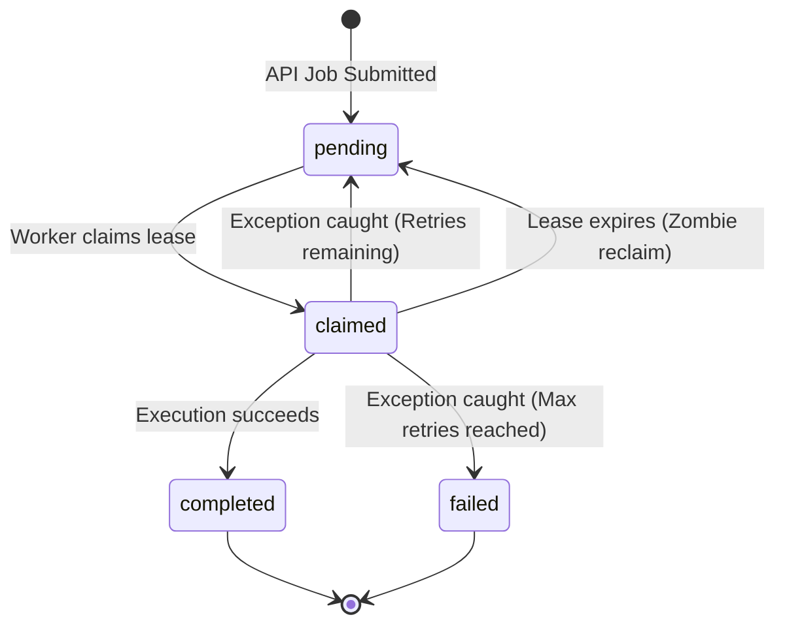

# Conveyor Engine

A distributed job queue and task execution engine built from scratch in Java.

Conveyor Engine is a self-hostable background job processing system. It handles job queuing, distributed worker execution, and failure recovery. It is intentionally built from the ground up without wrapping existing messaging middleware (like Redis, RabbitMQ, or Kafka) to directly address the challenges of distributed state, concurrent execution, and observability.

## Architecture

The system uses PostgreSQL as the backing store and queue mechanism, relying on `SELECT FOR UPDATE SKIP LOCKED` for atomic, concurrent-safe job claiming across multiple independent worker nodes.

### Tech Stack

* **Language:** Java 25
* **Database:** PostgreSQL 16
* **HTTP API:** Javalin
* **Data Access:** Jdbi3
* **Build/Deploy:** Gradle, Docker Compose

### Job Lifecycle (State Machine)

The core of the execution engine revolves around a strict state machine, ensuring jobs are processed at-least-once while safely handling worker crashes and exceptions.



### Project Structure

* `conveyor-api/`: The HTTP interface where clients submit jobs.
* `conveyor-worker/`: The execution nodes. Workers poll the database, concurrently claim jobs, execute them, and report status.
* `conveyor-core/`: Shared data models, database configurations, and DAO layers.

## Features & Roadmap

### Implemented

* **HTTP Job Submission:** REST API to submit job payloads.
* **Concurrent Job Claiming:** Database-level locking guarantees a single job is claimed by exactly one worker.
* **Structured Logging:** Standardized MDC logging with correlation IDs (Job IDs and Worker IDs) across all components.
* **Event Signaling:** PostgreSQL `LISTEN/NOTIFY` mechanism to wake up idle workers when new jobs are inserted, reducing polling latency.

### Upcoming / TBD

* **Dead-Letter Queue (DLQ):** Routing jobs that exhaust all retry attempts into a dedicated queue for manual inspection.
* **Robust Retry & Backoff:** Fully implementing exponential backoff for failed job retries.
* **Worker Heartbeating & Crash Recovery:** Detecting dead workers via missed heartbeats and reclaiming expired job leases.
* **Observability Dashboard:** A minimal TypeScript-based UI to inspect job states, queue depth, and metrics.
* **Backpressure Handling:** Explicit policies for handling overload when submission rates exceed worker throughput.

## Getting Started

### Prerequisites

* Java 25+
* Docker & Docker Compose

### Running the System Locally

You can spin up the entire system (Database, API, and Worker) using Docker Compose:

```bash
docker-compose up --build

```

Alternatively, to run the applications via Gradle for development:

1. Start only the database:

```bash
docker-compose up -d postgres

```

2. Run the API:

```bash
./gradlew :conveyor-api:run

```

3. Run a Worker node (in a separate terminal):

```bash
./gradlew :conveyor-worker:run

```

### Submitting a Job

Once the API is running (default `localhost:8000`), you can submit a job:

```bash
curl -X POST http://localhost:8000/jobs \
     -H "Content-Type: application/json" \
     -d '{
           "name": "test",
           "job_data": {
             "testString": "testData",
             "testNumber": 1,
             "testBoolean": true
           }
         }'

```

You should see the API accept the request, and the worker logs will indicate the job was claimed and processed.
